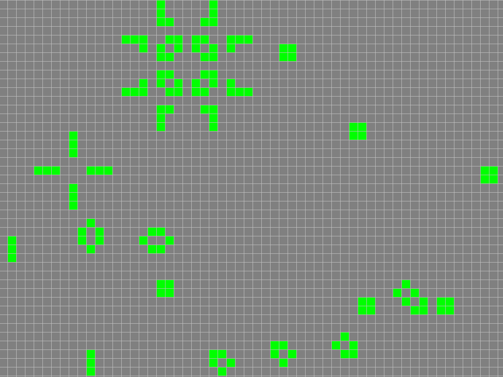

# Cellular Automatons

- Cellular automatons implementaion with visualization using SFML graphics.

- Features:
  - [x] Rule 110
  - [ ] Rule 30
  - [ ] Rule 60

## How to Use:
- Installing SFML dependencies:
  ```shell
  sudo apt-get update && sudo apt-get install libxrandr-dev libxcursor-dev libudev-dev libopenal-dev libflac-dev libvorbis-dev libgl1-mesa-dev libegl1-mesa-dev libfreetype6-dev
  ```
- Clonning:
  ```shell
  git clone https://github.com/mnink275/CellularAutomatons
  cd CellularAutomatons/
  git submodule update --init
  ```
- Running:
  ```shell
  make run-release
  ```
- Hold down the left mouse button and draw!


